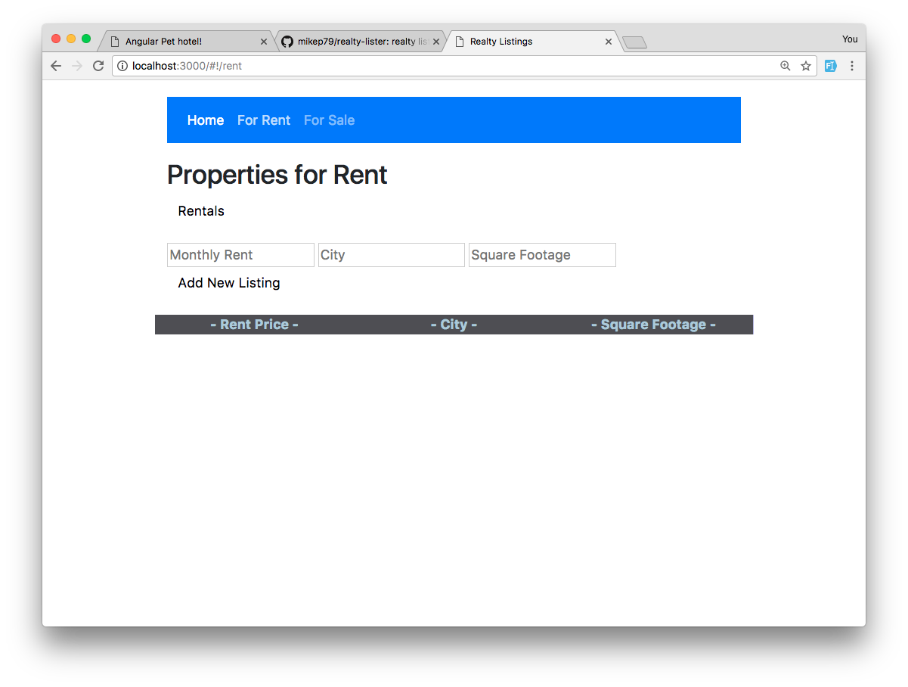

# Realty Lister
This full-stack web app was a Prime assignment. User can add a listing to the rental or housing listings, and view other listings. Listing information is stored in a Mongo database. App also features Bootstrap responsive styling.

 

 

## Features Added
- View rental and sale listings.
- Add a new listing.
- Bootstrap responsive styling.

## Features to add
- Delete a listing.
- Edit a listing.

## Technology Used
JavaScript, AngularJS, Bootstrap, MongoDB, Node.JS, Express.JS, HTML, CSS. 